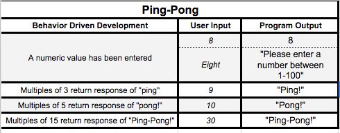

# _{Application Name}_

#### _{Brief description of application}, {Date of current version}_

#### By _**Michelle Poterek**_

## Description

<!-- _{This is a detailed description of your application. Its purpose and usage.  Give as much detail as needed to explain what the application does, and any other information you want users or other developers to have. }_ -->

#### Behavior Driven Development

## Setup/Installation Requirements

* _$ git clone https://github.com/PoterekM/Epicodus-track.git_
* _$ cd Epicodus-track_
* _$ open index.html_
* _OR here is the remote link: https://poterekm.github.io/Epicodus-track/_

<!-- * _This is a great place_
* _to list setup instructions_
* _in a simple_
* _easy-to-understand_
* _format_ -->
<!-- _{Leave nothing to chance! You want it to be easy for potential users, employers and collaborators to run your app. Do I need to run a server? How should I set up my databases? Is there other code this app depends on?}_ -->

## Known Bugs

<!-- _{Are there issues that have not yet been resolved that you want to let users know you know?  Outline any issues thxat would impact use of your application.  Share any workarounds that are in place. }_ -->

## Support and contact details

_Please feel free to contact me directly via e-mail at poterekm@gmail.com if you have any questions, comments, ideas, or feedback. Also, I invite you to feel empowered to make any changes to this repository by forking it and making changes accordingly._

## Technologies Used

_{Tell me about the languages and tools you used to create this app. Assume that I know you probably used HTML and CSS. If you did something really cool using only HTML, point that out.}_

### License

*This project is under the MIT License*

Copyright (c) 2017 **Michelle Poterek**
