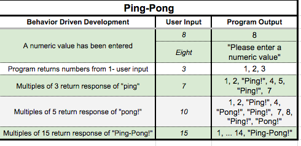

# _Ping-Pong_

#### _Epicodus Intro to Programming: Arrays and Looping independent project, June 9, 2017_

#### By _**Michelle Poterek**_

## Description

_This project takes a user's input number and presents a range from 1 to the chosen number. The stipulations are that:_
* Numbers divisible by 3 are replaced with "Ping!"
* Numbers divisible by 5 are replaced with "Pong!"
* Numbers divisible by both 3 and 5, or 15, are replaced with "Ping-Pong!"

#### Behavior Driven Development

## Setup/Installation Requirements

In order to clone this repository:

* _open Terminal and type_
* _$ git clone https://github.com/PoterekM/Epicodus-track.git_
* _$ cd Epicodus-track_
* _$ open index.html_
* _OR here is the remote link: https://poterekm.github.io/Epicodus-track/_

<!-- * _This is a great place_
* _to list setup instructions_
* _in a simple_
* _easy-to-understand_
* _format_ -->
<!-- _{Leave nothing to chance! You want it to be easy for potential users, employers and collaborators to run your app. Do I need to run a server? How should I set up my databases? Is there other code this app depends on?}_ -->

## Support and contact details

_Please feel free to contact me directly via e-mail at poterekm@gmail.com if you have any questions, comments, ideas, or feedback. Also, I invite you to feel empowered to make any changes to this repository by forking it and making changes accordingly._

## Technologies Used

_This project utilizes jQuery (version 3.2.1) and Bootstrap for styling._

### License

*This project is under the MIT License*

Copyright (c) 2017 **Michelle Poterek**
